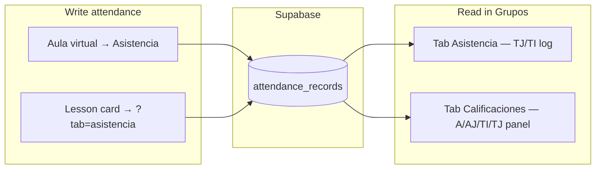

# Asistencia (Grupos tab)

Read-only **tardías** view on the group page. Teachers **take** attendance in
**Aula virtual → Asistencia**; this tab **aggregates** what was already saved.

**Route:** `/grupos/[id]?tab=asistencia`  
**Legacy alias:** `?tab=tardias` (same view)  
**Hub doc:** [`grupos.md`](grupos.md)

## User flow

1. Teacher opens **Mis grupos → [grupo] → Asistencia**.
2. Sees per-student **TJ**, **TI**, and **total** tardías (all dates in this class).
3. Scrolls the **bitácora** — each row: date, student, TJ/TI badge, optional comment.
4. To mark today’s class: **Pasar asistencia** → `/aula-virtual/[classId]?tab=asistencia`.

## What this tab is not

- Not the **Libro de clase** — no date picker, no P/AJ/A marking, no autosave grid.
- Not a replacement for the gradebook **Asistencia** panel (that shows **four**
  ausencia codes A/AJ/TI/TJ as cumulative counts on the Calificaciones tab).

## Data source

Rows come from **`attendance_records`** where `status` is:

- `late_justified` (TJ)
- `late_unjustified` (TI)
- legacy `late` → normalized to TI

Loader: **`loadClassTardias(classId)`** in `src/lib/dashboard/attendance.ts`  
RLS: same class-member read rules as the register (`20260912180000_attendance_ausencias.sql`).

Optional **`comment`** on each row (teacher note) — migration
`20260914200000_attendance_comment.sql`.

## UI

| Piece | File |
| ----- | ---- |
| Workspace | `src/components/grades/tardias-workspace.tsx` (`AttendanceGroupWorkspace`) |
| Tab switcher | `src/components/grades/grupo-section-tabs.tsx` |
| Page | `src/app/(app)/grupos/[id]/page.tsx` |
| Model helpers | `src/lib/attendance/model.ts` — `TardiaRecord`, `summarizeTardias()`, `ATTENDANCE_CODE` |
| i18n | `messages.ts` → `attendance.groupView.*`, tab label `grupos.tabs.attendance` |

Active tab pill uses the **yellow** tone; Calificaciones = purple, Conducta = rose.

## Relationship diagram

## Follow-ups

- Show **AJ/A** in this tab (full attendance log, not only tardías).
- Deep-link bitácora row to aula virtual on that date.
- Parent/student mobile read of attendance (not built).
